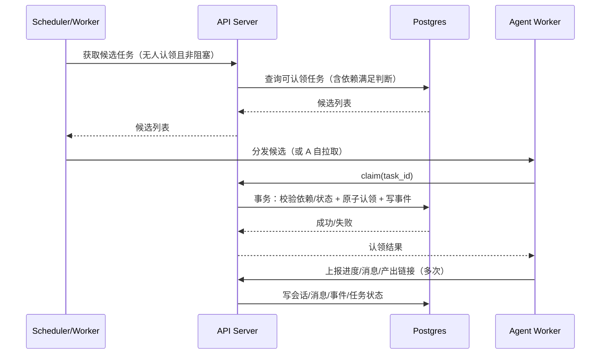

# 架构设计：prj_kanban（面向 AI Agent 的开发任务看板与依赖约束）

本文档基于 [PRD_kanban_agent.md](file:///d:/work/projs/prj_kanban/docs/PRD/PRD_kanban_agent.md) 的功能与验收标准，给出可落地、可演进的系统架构设计。

## 1. 架构目标

- 支撑任务看板、任务依赖（DAG）与 Agent 自动认领/执行的闭环
- 在并发场景下保证任务认领与状态流转的一致性与可追溯性
- 为人类提供可解释的进度视图、依赖阻塞视图与审计时间线
- 支持 Agent 会话、对话记录留存、归档与销毁（保留期可配置）
- 便于后续接入 Git/CI、关键路径（CPM）优先级策略与更多 Agent

## 2. 架构原则与关键决策

- 单一事实来源：以数据库中的“任务当前状态 + 事件流水”作为系统真实来源
- 事件驱动与可观测：所有关键变更写入事件表，UI 订阅事件获得实时更新
- 强一致的“认领”：认领接口必须原子化，避免重复认领与脏写
- 读写分离的投影：写事件、写状态；读侧以投影表/索引支持快速查询与列表
- 可演进：MVP 用简单队列/Worker；复杂工作流再引入编排引擎

## 3. C4：Context（系统上下文）

### 3.1 外部参与者

- 人类用户：负责人/开发者/观察者，通过 Web UI 使用系统
- AI Agent：通过 API/队列获取任务、执行并回写进度与产出

### 3.2 外部系统（可选）

- 代码托管平台：GitHub/GitLab（PR/Commit/Issue/Webhook）
- CI 平台：GitHub Actions/Jenkins（构建状态回写）
- 对象存储：用于会话归档产物（S3/MinIO 等）
- 通知渠道：邮件/IM（任务被认领、阻塞解除、失败告警）

## 4. C4：Container（容器级划分）

建议按“Web + API + Worker + 存储”划分，便于扩展 Agent 数量与执行吞吐。

- Web App（前端）
  - 看板视图、依赖图视图、任务详情、会话/时间线查看与导出
  - 与 API 通信获取数据，订阅实时事件（SSE/WebSocket）
- API Server（后端）
  - 提供任务/依赖/认领/状态机/会话/审计等接口
  - 承担权限校验、环检测、认领原子性与一致性事务
- Agent Worker（执行器）
  - 通过队列或 API 获取可认领任务，执行并持续上报进度与消息
  - 可水平扩展多个实例
- Scheduler（调度器，可与 Worker 合并）
  - 周期性扫描无人认领且可认领任务，触发“候选任务”事件或入队
- Database（PostgreSQL）
  - 任务、依赖边、事件流水、会话记录与审计数据
- Cache/Queue（Redis）
  - 任务执行队列、分布式锁（如需要）、会话短期状态缓存
- Object Storage（可选）
  - 会话归档包、导出包等冷数据存储

## 5. C4：Component（组件职责）

### 5.1 API Server 组件

- Task Service：任务 CRUD、状态机转换、看板查询
- Dependency Service：依赖边维护、环检测、阻塞原因计算
- Claim Service：认领/释放的原子写入与并发控制
- Event Service：事件写入与查询（时间线），支持订阅推送
- Agent Session Service：会话创建、心跳、进度上报、对话记录写入
- Archive Service：归档与销毁策略执行（触发归档作业、生成归档记录、裁剪热数据）
- Auth/RBAC：身份认证、角色与权限校验

### 5.2 Agent Worker 组件

- Claim Candidate Fetcher：拉取候选任务（或从队列订阅）
- Strategy Engine：候选任务排序（优先级/关键路径/风险）
- Executor：调用工具链（代码生成、测试、PR 创建等）并回写结果
- Progress Reporter：按步骤回写进度事件与会话消息
- Failure Handler：失败分类、重试/转交/回滚建议

## 6. 核心数据模型（概念级）

### 6.1 主表（写模型）

- tasks
  - id, title, description, status, assignee_type(human/agent/none), assignee_id, priority, created_at, updated_at, version
- dependency_edges
  - from_task_id, to_task_id, created_at
- agent_sessions
  - id, task_id, agent_id, status, started_at, ended_at, last_heartbeat_at, progress_json
- agent_messages（可选：热存）
  - id, session_id, ts, role, content, tool_call_json, token_usage_json, redacted(bool)
- task_events（append-only）
  - id, task_id, type, actor_type, actor_id, payload_json, ts
- archive_records（可选）
  - id, task_id, session_id, artifact_uri, hash, size_bytes, created_at, retention_until

### 6.2 一致性策略

- “任务当前状态”与“事件流水”同时写入同一事务（或采用 outbox）
- 认领与状态流转使用乐观锁（version）或数据库行锁，确保并发下单写成功
- 依赖边写入前进行环检测，拒绝形成环的写入

## 7. 关键流程（建议用事件 + 事务）

### 7.1 Agent 自动认领（符合 FR-12~FR-15）

认领接口的硬约束：

- 若存在未完成前置任务（FR-5），返回不可认领
- 若已被认领（FR-6），返回冲突
- 必须写入事件与审计字段（FR-21/FR-22）

### 7.2 依赖新增与环检测（符合 FR-9~FR-11）

实现要点：

- 新增 A → B 前做可达性检查：若从 B 可达 A，则形成环，拒绝
- 写入成功后，更新 B 的阻塞信息投影（或在读侧计算）

### 7.3 会话记录、归档与销毁（符合 FR-23~FR-28，AC-7~AC-9）

建议拆为两阶段：

1) 任务执行中（热路径）
- Agent 写入：session 心跳、progress_json、message（可选）、event
- UI 通过事件订阅实时展示进度与对话

2) 任务完成后（冷路径，异步作业）
- 触发归档作业：将事件与对话导出为 transcript（jsonl/markdown），压缩后写入对象存储
- 写 archive_record
- 按保留策略裁剪/删除 agent_messages 的大字段或整表记录，仅保留最小审计摘要
- 销毁会话：标记 session 为 destroyed，并释放执行侧资源（停止运行/清理临时文件/清理 Redis keys）

## 8. 接口设计要点（与 PRD 接口示例对齐）

### 8.1 原子认领

- POST /tasks/{id}/claim
  - 输入：actor（agent/human）、可选 reason
  - 行为：事务内校验可认领条件 + 更新 tasks.assignee + 写 task_events + 创建/更新 agent_session
  - 输出：成功返回任务与会话 id；失败返回明确原因（依赖未满足/已被认领/状态不允许）

### 8.2 会话进度与消息

- POST /sessions/{id}/progress
- POST /sessions/{id}/messages
- GET /tasks/{id}/timeline
- GET /tasks/{id}/sessions
- GET /archives/{id}/download（如支持导出/归档下载）

## 9. 权限与安全

- RBAC：Owner/Dev/Observer/Agent，最小权限原则（PRD 第 7 节）
- 数据脱敏：对话与工具调用记录在落库前进行敏感字段识别与脱敏
- 审计：所有 claim、依赖变更、状态机转移必须写入 task_events
- 秘钥管理：LLM Key、Git Token 等只存在于安全配置与运行时，不进入日志与对话存储

## 10. 可观测性与运维

- 指标：认领成功率、冲突率、被阻塞任务数、归档作业成功率、会话平均时长
- 日志：所有 API 请求与 Worker 执行日志带 session_id/task_id 关联字段
- Trace：关键链路（claim -> execute -> report -> complete）具备 trace/span
- 告警：归档失败、会话心跳超时、任务长期阻塞

## 11. 演进路线

- MVP：Postgres + Redis 队列 + API + Worker，满足 AC-1~AC-9
- 增强：引入 CPM 关键路径计算（PRD 第 11 节）进入策略引擎
- 深度联动：Git/CI Webhook 驱动任务状态与产出链接自动回写
- 复杂工作流：如出现分支/补偿/长事务编排需求，再引入工作流引擎（如 Temporal）

