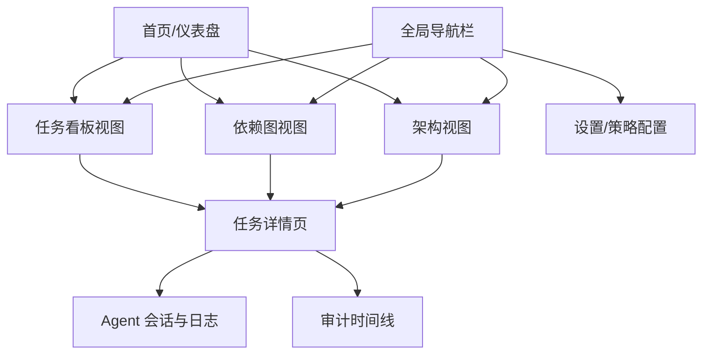

# 前端界面设计文档：Constellation

本文档基于 [PRD_kanban_agent.md](../PRD/PRD_kanban_agent.md) 与 [ARCH_constellation.md](../Architecture/ARCH_constellation.md) 编写，旨在定义 `Constellation` 的前端交互界面、视觉规范与关键流程体验。

## 1. 设计概述

本系统核心在于**将“任务状态流转”与“任务依赖约束”可视化**，并为**人类与 AI Agent 的协作**提供直观的交互界面。

### 1.1 设计哲学：数字清水混凝土 (Digital Concrete)
深受**安藤忠雄 (Tadao Ando)** 建筑风格的启发，本系统采用“清水混凝土”美学风格。
*   **几何与秩序 (Geometry & Order)**：利用严格的网格系统与几何图形构建界面，传达逻辑与稳固感。
*   **光与影 (Light & Shadow)**：不使用过度的装饰，而是通过微妙的阴影与光感（Gradients/Shadows）来塑造深度与层级，模拟光线在混凝土墙面上的游走。
*   **材质感 (Materiality)**：界面底色采用带有细微颗粒感的“混凝土灰”，营造冷静、专注的开发氛围。
*   **留白 (Ma / Negative Space)**：强调“间”的概念，通过大量留白突出核心内容，让信息“呼吸”。

### 1.2 设计目标
1.  **直观展示阻塞关系**：在看板与依赖图中清晰标识“阻塞（Blocked）”状态，让人类一眼识别瓶颈。
2.  **实时感知 Agent 行为**：Agent 的认领、执行进度、对话消息需实时反馈（Real-time），建立“人机协作”的临场感。
3.  **双视图融合**：提供“项目进度（看板）”与“系统结构（架构图）”两种视角，并支持互相跳转。

---

## 2. 信息架构 (Information Architecture)

---

## 3. 关键视图设计

### 3.1 全局导航栏 (Global Navigation)
*   **位置**：顶部或左侧固定。
*   **元素**：
    *   Logo / 项目名称。
    *   **视图切换器**：看板 (Board) | 依赖图 (Graph) | 架构 (Architecture)。
    *   **Agent 状态指示器**：显示当前活跃 Agent 数量 / 正在执行的任务数（如："🟢 2 Agents Working"）。
    *   **通知中心**：Agent 认领、任务阻塞解除、执行失败等消息通知。
    *   **用户头像**：个人设置。

### 3.2 任务看板视图 (Kanban Board)
*   **核心功能**：任务状态流转管理。
*   **布局**：
    *   **工具栏**：搜索框、过滤器（负责人: Human/Agent、标签、状态）、新建任务按钮。
    *   **泳道/列**：
        1.  **To Do (待办)**：未开始的任务。
        2.  **In Progress (进行中)**：正在执行的任务。
        3.  **Blocked (已阻塞)**：因前置依赖未完成或人工标记而无法推进的任务。
        4.  **Done (已完成)**：执行完毕。
*   **任务卡片 (Task Card) 设计**：
    *   **标题**：清晰展示任务名。
    *   **ID**：短 ID（如 #1024）。
    *   **负责人头像**：
        *   人类：显示用户头像。
        *   Agent：显示机器人图标（并带有呼吸灯效果表示“正在思考/执行”）。
    *   **状态标记**：
        *   **阻塞态**：红色边框或红色角标，Hover 显示“阻塞原因：依赖 #1021 未完成”。
        *   **Agent 执行中**：显示简略进度条或当前步骤（如 "Running Tests..."）。
    *   **优先级**：颜色条（High-Red, Medium-Orange, Low-Blue）。
    *   **关联架构**：小图标显示关联的组件（如 "Login Service"）。

### 3.3 依赖图视图 (Dependency Graph)
> **详细设计文档**：请参考 [UI_Design_Graph_Page.md](./UI_Design_Graph_Page.md)

*   **核心功能**：可视化 DAG（有向无环图），管理任务依赖。
*   **交互**：
    *   **缩放/平移**：支持鼠标滚轮缩放、拖拽平移画布。
    *   **节点 (Node)**：代表任务。
        *   颜色编码：Green (Done), Blue (Doing), Grey (To Do), Red (Blocked)。
        *   形状：矩形或圆角矩形。
    *   **连线 (Edge)**：代表依赖关系（A -> B，表示 B 依赖 A）。
        *   实线：强依赖。
        *   虚线：弱依赖或关联。
    *   **操作**：
        *   **连线创建**：从节点 A 拖拽连线到节点 B，建立依赖。
        *   **环检测反馈**：若拖拽导致闭环，连线变红并弹出警告“Detected Cycle”，禁止释放。
    *   **侧边栏**：点击节点后，右侧弹出任务简略信息面板。

### 3.4 任务详情页 (Task Detail Modal/Page)
*   **布局**：双栏布局（左 2/3 内容，右 1/3 属性与关联）。
*   **左侧主要区域**：
    1.  **头部**：标题、ID、状态面包屑。
    2.  **描述**：Markdown 渲染的任务描述。
    3.  **Agent 工作区 (Agent Workspace)**：
        *   **当前会话 (Session)**：
            *   **进度条**：显示 Agent 执行进度百分比。
            *   **终端/日志视窗**：实时滚动显示 Agent 的思考过程与工具调用（"Thinking...", "Executing: git clone...", "Writing code..."）。
            *   **对话框**：人类可输入指令干预 Agent，或回答 Agent 的提问（Human-in-the-loop）。
        *   **产出物 (Artifacts)**：自动列出生成的 PR 链接、Commit Hash、部署 URL。
    4.  **活动时间线 (Timeline)**：
        *   以时间倒序展示：创建 -> 依赖变更 -> Agent 认领 -> 进度上报 -> 完成。
*   **右侧属性区域**：
    1.  **属性**：负责人、优先级、预估时间。
    2.  **依赖关系**：
        *   **Predecessors (前置)**：列出阻塞当前任务的任务列表（点击跳转）。
        *   **Successors (后继)**：列出当前任务阻塞的任务列表。
    3.  **架构关联**：关联的 Component/Service。

### 3.5 架构视图 (Architecture View)
*   **核心功能**：基于 C4 模型展示系统结构，并映射任务分布。
*   **层级**：System Context -> Container -> Component。
*   **热力图模式**：
    *   在架构图组件上叠加“活跃任务数”或“Bug 数”的热力层。
    *   例如：“API Server”组件显示红色高亮，提示有 5 个 Blocked 任务关联于此。
*   **交互**：点击组件，跳转到看板并自动过滤出关联该组件的任务。

---

## 4. 交互流程设计

### 4.1 任务认领与防冲突
1.  **人类认领**：
    *   用户点击“认领”按钮。
    *   **前端校验**：检查是否有未完成的前置依赖。
        *   若有：按钮置灰或点击报错，提示“需先完成 #101, #102”。
    *   **后端校验**：API 返回成功后，界面立即更新负责人头像。
2.  **Agent 认领（自动）**：
    *   界面无需人工操作，通过 WebSocket/SSE 接收事件。
    *   当 Agent 认领成功，卡片瞬间从“待办”列跳动/闪烁，头像变为 Agent 图标，状态自动切为“进行中”。

### 4.2 依赖管理与环检测
1.  用户在“依赖图视图”进入“编辑模式”。
2.  用户尝试连接 Task A -> Task B。
3.  **实时反馈**：
    *   鼠标释放前，前端预计算可达性（Reachability）。
    *   若 B -> ... -> A 路径存在，连线显示为红色叉号，Tooltip 提示“禁止创建环依赖”。
    *   若合法，连线显示为绿色/灰色。

### 4.3 Agent 执行实时反馈
1.  Agent 在后端执行任务，产生日志流。
2.  前端通过 SSE (Server-Sent Events) 订阅 `/tasks/{id}/events`。
3.  **动态效果**：
    *   详情页的“终端视窗”像打字机一样逐行显示日志。
    *   看板卡片上的进度条实时增长。

---

## 5. 视觉规范 (Visual Guidelines - Ando Style)

### 5.1 色彩体系：混凝土与光 (Concrete & Light)

摒弃高饱和度的糖果色，采用极简的灰度阶梯，仅在关键状态使用克制的强调色。

*   **Background (Canvas)**:
    *   `#F0F2F5` (Light Concrete) - 全局背景，带有极淡的冷调。
    *   `#EAECEF` (Rough Concrete) - 侧边栏/次级背景，模拟混凝土质感。
*   **Surface (Card/Panel)**:
    *   `#FFFFFF` (Pure Light) - 任务卡片，如同光线投射在墙面上。
    *   `#FAFAFA` (Smooth Finish) - 交互区域。
*   **Typography**:
    *   `#262626` (Ink Black) - 主标题，强烈对比。
    *   `#595959` (Dark Grey) - 正文。
    *   `#8C8C8C` (Medium Grey) - 辅助信息。
*   **Accent Colors (Status)**:
    *   **Blocked**: `#A8071A` (Architectural Red) - 深沉、警示的红，非刺眼亮红。
    *   **In Progress**: `#003EB3` (Deep Blue) - 深邃的蓝，代表理性与执行。
    *   **Done**: `#389E0D` (Nature Green) - 带有自然气息的绿，如同混凝土缝隙中的苔藓。
    *   **Agent**: `#531DAB` (Mystic Purple) - 智慧与未知的象征。

### 5.2 阴影与质感 (Shadow & Texture)

*   **光影 (Lighting)**:
    *   光源设定为左上方 45 度。
    *   **Drop Shadow**: `0 4px 12px rgba(0, 0, 0, 0.08)` - 柔和、弥散的阴影，使卡片产生悬浮感。
    *   **Inner Shadow**: 仅用于输入框或凹槽，模拟混凝土模具的凹陷。
*   **边框 (Borders)**:
    *   极细边框 `1px solid #D9D9D9`，或者无边框仅靠阴影区分。
*   **圆角 (Radius)**:
    *   `2px` 或 `0px` (Sharp) - 保持建筑的棱角感，拒绝大圆角。

### 5.3 字体排印 (Typography)

*   **Font Family**:
    *   英文：`Inter` 或 `Helvetica Neue` (经典、中性)。
    *   代码/ID：`JetBrains Mono` 或 `Roboto Mono` (工程感)。
*   **排版原则**:
    *   大字重对比：标题使用 `Bold` 或 `Black`，正文 `Regular`。
    *   宽字间距 (Tracking)：标题增加微量字间距，营造呼吸感。

### 5.4 图标体系 (Iconography)
*   **风格**：Line / Stroke (线性图标)。
*   **粗细**：`1.5px` 或 `2px` 统一描边，如同建筑图纸的线条。
*   **隐喻**：
    *   **Human**: 极简线条人像。
    *   **Agent**: 几何晶体或简单的光点。
    *   **Dependency**: 直线与直角折线（避免贝塞尔曲线），模拟电路或管道。

---

## 6. 技术选型建议 (Frontend Stack)

*   **框架**: React (Next.js 或 Vite SPA)
*   **UI 组件库**: Ant Design / MUI / Shadcn UI (推荐 Shadcn 以便于定制)
*   **图表/可视化**:
    *   依赖图: React Flow / G6
    *   架构图: Mermaid.js (渲染) / React Flow
*   **状态管理**: Zustand / Jotai (轻量级)
*   **数据获取**: React Query (SWR) + Axios
*   **实时通信**: Socket.io-client / EventSource (SSE)
*   **Markdown 渲染**: react-markdown (用于任务描述与 Agent 对话)
